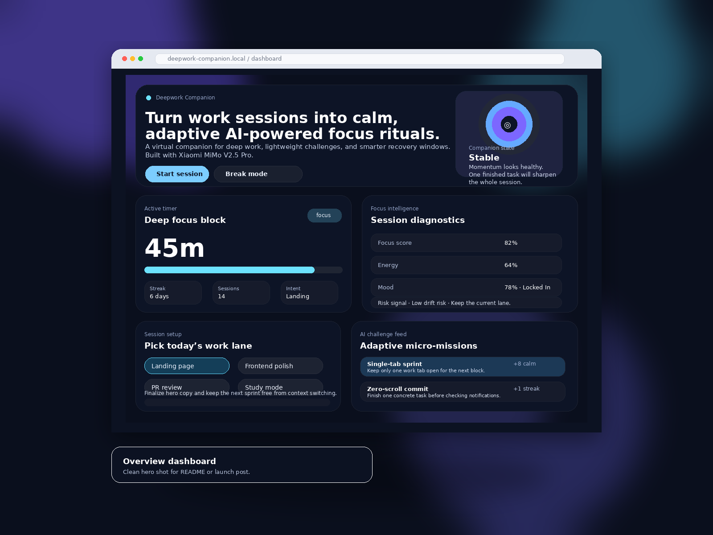
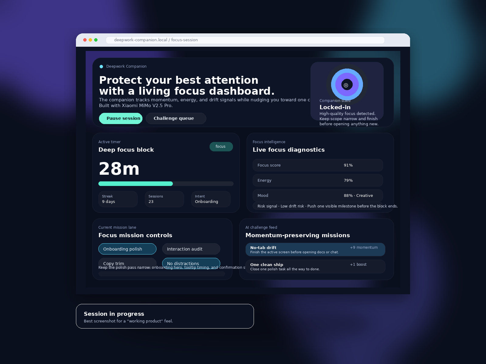
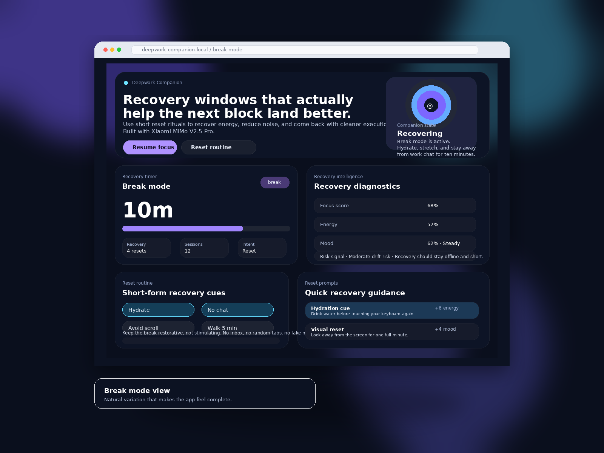
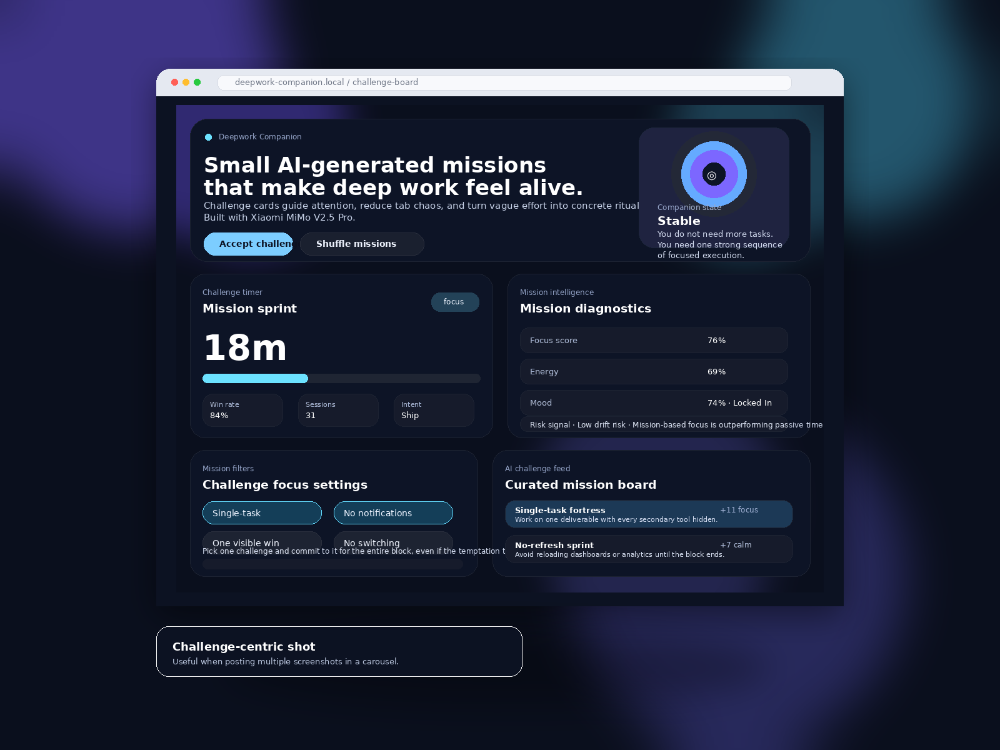
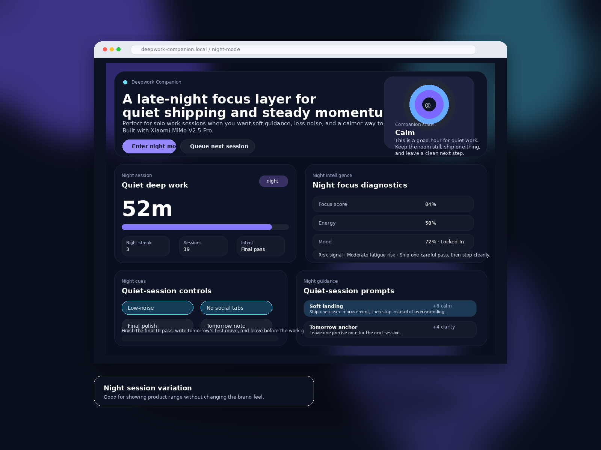

# Deepwork Companion

A polished single-page web app prototype that turns work sessions into calm, adaptive focus rituals with AI-style guidance, challenge cards, and companion diagnostics.

**Built with Xiaomi MiMo V2.5 Pro.**

## Overview

Deepwork Companion is a lightweight productivity dashboard for makers, students, and developers. It blends a virtual focus companion, deep-work timer, adaptive challenge feed, and session diagnostics into a playful interface that feels more alive than a typical pomodoro timer.

## Why this project works for a Xiaomi MiMo-style showcase

- Clear product concept with a distinct AI companion angle
- Visually polished interface that feels demo-ready
- Multiple states for storytelling: focus, break, challenge, and night mode
- Strong branding fit for an AI creative / productivity portfolio piece

## Features

- Adaptive focus / break mode switching
- AI-style companion state and live guidance
- Focus score, mood, energy, and momentum diagnostics
- Intent selection for different work lanes
- Challenge feed with micro-missions and reward cues
- Clean glassmorphism-style UI suitable for demos and screenshots

## Screenshots

### Overview


### Session running


### Break mode


### Challenge view


### Night mode


## Tech Stack

- Vite
- Vanilla JavaScript
- CSS

## Local Development

```bash
npm install
npm run dev
```

## Build

```bash
npm run build
```

## Regenerating screenshots

The polished screenshots in `screenshots_v2/` are generated marketing assets, not live browser captures.

To regenerate them:

```bash
python3 -m venv .venv
. .venv/bin/activate
pip install -r requirements-screenshots.txt
python generate_mock_screenshots.py
```

The generator script uses common Linux/macOS/Windows font paths and falls back to Pillow defaults if a matching system font is unavailable, so regenerated layouts may vary slightly across machines.

## Notes

This repo is designed as a clean AI productivity concept piece rather than a production SaaS app. Its main strength is concept quality, visual presentation, and demo readiness.
